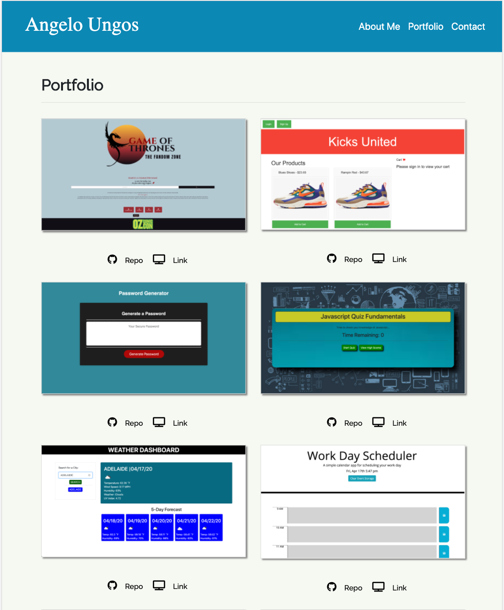
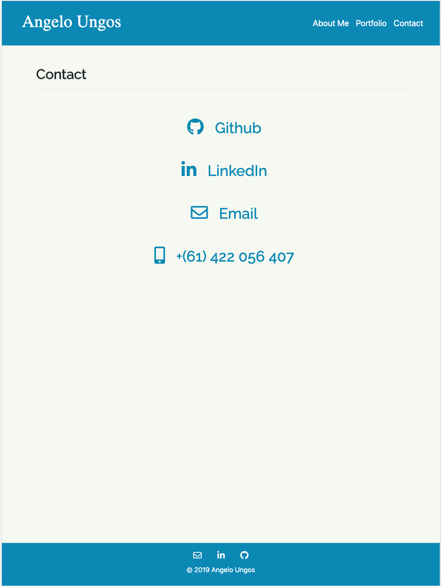

# UpdatedPortfolio

Link for the deployed application: https://vlad916.github.io/UpdatedPortfolio/

This is an updated portfolio that is build towards being a employer competitive. Bootstrap and css framework
was used for the basic layout and the page's responsiveness to all devices. Also to feature the recent projects 
made in the bootcamp. 

 

